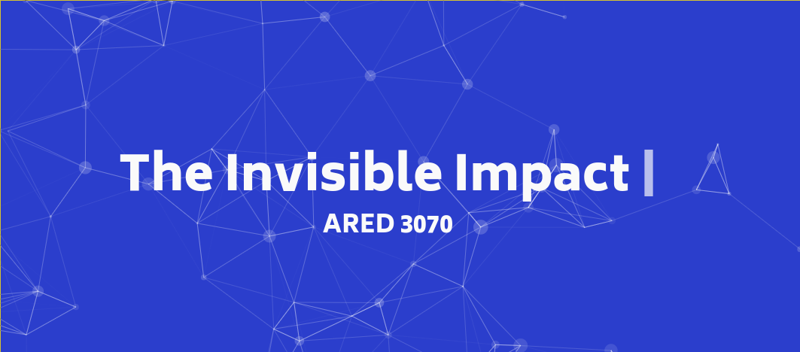
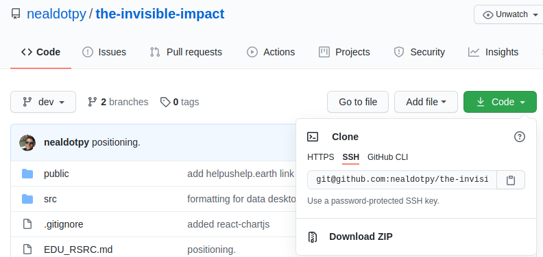
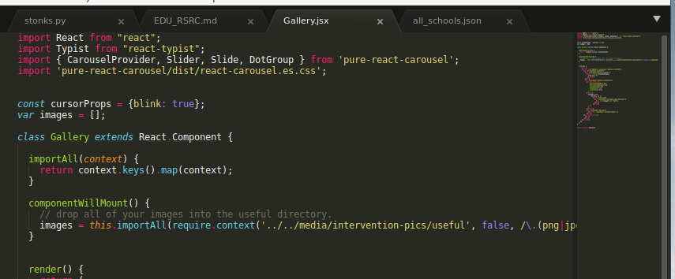
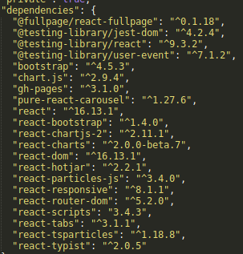
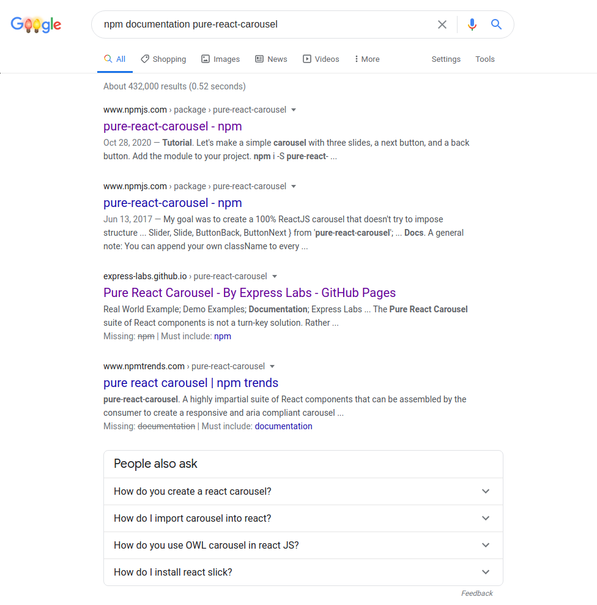

# Introduction

If you are reading this as a PDF, it is best viewed in the original rendered source: https://github.com/nealdotpy/the-invisible-impact/blob/dev/EDU_RSRC.md.

Creating simple, yet compelling messages is becoming increasingly difficult to accomplish in a world filled with distractions. Even more so, technological literacy is accelerating. I firmly believe that within the next twenty years or so we will see the widespread acceptance of computer science fundamentals on a grade school level.

In one form or another, it will become paramount to teach students about programming, binary, and other basic computer science concepts in a similar fashion to how our pupils learn about fractions, infinity, limits, etc today.

This resource is meant to be a lightweight guide that assumes very little foundational knowledge. However, it will be written in a manner that would be suitable to the future generations. Perhaps it could even act as a time capsule, standing the test of time. This guide would be easily understood by (potentially) ten year-olds in the Year 2050. How crazy?

**Side Note:** With the advent of language models such at [GPT-3](https://openai.com/blog/openai-api/), it's unlikely that this guide would *actually* be used in 2050. More likely, the fundamentals from the guide would hold true; however, more people will be able to [simply dictate functionality and design to an AI that would quite literally code for you](https://twitter.com/sharifshameem/status/1282676454690451457). It's already happening, and it will only get better.

**Side, Side Note:** While Software Engineers, Mathematicians, and Physicists are quite literally the most coveted people on the planet at the moment, even we are in danger of becoming completely extinct. Blue Collar Jobs have already died. White Collar Careers, such as accounting and law, will become exinct (or reduced by 80%) in the next 10 years. Why am I including this? I just want to cement my predictions on the internet.

I'm getting too cynical again. Moving on.

If I was a writing a mathematical resource in 2020, I would not start by explaining how counts of items can be abstracted by symbols we call numbers. Instead, I would simply begin by using those abstractions and talking about addition, subtraction, multiplication, and division. You need not mentally subtract 2 pencils from 5 pencils to obtain 3 pencils. Instead, you define these abstractions by their relation with each other. That is what empowers its usage.

I digress.

# Purpose

This educational resource will serve as a from-scratch how-to guide to building a digital intervention. In addition, it will (hopefully) allow those with very little experience to experience the thrill of tweaking and building something of their own.

If you are already familiar with Git, GitHub, NPM, and Command-Line feel free to skip the following sections and jump straight to [Staging A Digital Intervention](#staging-a-digital-intervention).

# Crash Course To The 21.5st Century

### Files, Folders, and more!

On your computer, everything can be broken down into two atomic types: files and folders.

Folders contain other folders and files, right? Folders do contain those things; however, as newly annointed 21.5st century students, we throw out the 20th century notion of folders. We more accurately call these things **directories**, mainly because they index other directories and files.

Now, files contain data that might include instructions for your computer to open Netflix and continue the latest episode of *New Girl*, or it might pull up the PDF rubric for an assignment. While it is not important to understand for this resource, technically, directories are just files with the locations of other files. Everything is a file! Yay!

### What Is Git?

#### Background

Imagine if you are working on an extremely complex document--a study guide, potentially with many other people. It would become annoying if you were being worked over, or if you halted your own work because someone was working on a piece of the document you also needed to work on.

In addition, what if someone makes a mistake? What if you make a mistake? What if something gets deleted that you needed? What if another document that linked to your document was deleted, breaking the connection?

This is where Git comes in. Git is what is known as a **version control system**, or VCS for short. Git will take all of your project documents and put them into something computer scientists like to call a tree.

#### Git

You might be familiar with `Control-S` or `Command-S` for saving documents. Basic save operations create lines, not trees. You are able to undo and redo, going backwards and forwards respectively, in your document. However, this is not always helpful; imagine a situation where Jessica edits something you wrote. However, Jessica made a mistake, and you cannot undo her mistake since you did not make it. We clearly need a more robust "save" system.

The tree allows you to jump back and forth through time, viewing your project and its state at different points. It even allows you to seperate out who did what, when, and why.

#### Git Workflow

In Git, you do not `save`; instead, you `commit`. 

**Note:** you would still regularly save the file you're working on as you would. Git is not a replacement for "saving." Rather, it is a robust system that overlays it.

When you make a commit, it's customary to include a message: `git commit my_study_guide -m "added a section for how to take derivatives"`. Here, we issue a command to Git, telling it that we want to make a commit (think save) to `my_study_guide` with a `-m`essage which contains a brief description of what we did.

Where do we issue these commands? Who is Git? You can think of Git as a worker ready to take instructions at will; however, it will only accept a certain type of format for its instructions, otherwise it does not know what to do. This worker lives in your computer!

Using what is known as the Terminal, we can issue these commands. Remember a time when you've seen a bunch of random scrolling text on a black screen, typically portrayed as hacking? That's a terminal!

In fact, as I develop this resource, I am using git to ~save~ commit my changes!

I know it looks scary, but I assure you it's easier than it looks!

#### More About Command-Line

You might have noticed in the screenshot, my terminal tells me some additional info. For example, `neal:sus-and-env` lets me know that the current user is me, neal! It also tells me that I am currently executing my commands in a directory called `sus-and-env`. Additionally, `git:dev` lets me know that I am currently in a git-enabled directory, and my current **branch** is called `dev`, which is short for development.

#### Branching

Branching is quite literally what it sounds like! We talked about how our VCS is a tree! Well, we call it a tree because it has branches! Now many philosophies exist for *how* your branches should be set up. Some people will assign a branch to each person's work. Other systems will assign branches based on what is being worked on, regardless of how many people are working on it. 

*How* you branch is not as important as *why* you branch. When you create a branch, you are making a perfect replica of the project and *branching* it away from another branch, say the `main` branch. It is important to note that the simplest branch is a branch which contains nothing.

This will allow you to compare changes later amongst other branches. Then everyone can come together and decide what belongs on the `main` branch. The most important part here is that no matter what you do, a branch will save that **history** of work. So you branch to make it easier to navigate your changes and your project. Every project will have at least one branch, the `main` branch. Depending on the situation, some people choose to rename it.

For example, if I am creating a simple single-page application (SPA) website, I will typically call my `main` branch `dev`. Mainly because, after you finishing **developing** on the `dev` branch, you need to **build** your code so it can run on a server on the internet. Perhaps we call our branch with built code `build`. Notice, the `build` branch is not going to be a copy of `dev`. So it is not a strict requirement that branches contain the same or similar content.

**In summation,** git is a useful tool that empowers collaboration (with yourself or others) without sacrificing precision or control. It is quite literally what makes the world go round. That is not a hyperbole.

### What is NPM?

#### Background 
Now, as someone who is well-versed in git, you might be curious as to what exactly it can do beyond saving. Well, GitHub allows for the upload and sharing of open source programs. These are typically managed by many people using git on their local machines. GitHub makes it possible to upload these projects to a centralized location. 

Any public GitHub project is typically considered Open Source and [Copyleft](https://www.gnu.org/licenses/copyleft.en.html). This means that you can use this command-line tool to download other people's work and modify it to your heart's content, granted you follow Copyleft guidelines. It also allows for an easy way to vet programs to make sure that they are not malicious. Since the code is 100% visible to the public, it would take monumental efforts (nearly infinte) to obscure and disseminate malicious code. 

#### NPM

So, what does this have to do with NPM? Well, we need to back up to answer that.

Most of the web today uses a scripting langauge called JavaScript. Why? It makes creation of complex applications efficient, thus allowing for highly responsive and functional user interfaces (UIs). Almost any site that you use is built using JavaScript. The days of pure HTML and CSS are nearly over (unfortunately, depending on who you ask).

Now, would it not be dandy if you could just start building a website in JavaScript without doing all the repetitve groundwork that it takes to build a website? Well that's where the **N**ode **P**ackage **M**anager comes in!

NPM is a [JavaScript development tool that enhances developer workflows.](https://www.npmjs.com/)

**Note:** alternatives to NPM exist, such as [yarn](https://yarnpkg.com/).

Installing NPM is trivial for a command-line user; just follow the four instructions on the NPM website. Once you have NPM, you can now bring together all your knowledge to understand the foundation we've built.

#### Putting It All Together

So we know that developers can create projects, and they can work on them with other people. This group would also use git to keep their local and centralized (GitHub) workflows up-to-date and working. In addition, they can also publish their repositories so that others may use their software.

NPM contains a **wrapper**, or a piece of software that encapsulates another by adding additional functionality, around Git that allows developers to easily download and install other people's GitHub projects (that are written specifically in JavaScript for web). Since these projects are officially supported by NPM, we call them **modules** or **packages**. NPM allows us to, in one or two commands, grab all of someone else's work, install it into our own project, and start using it immediately.

Isn't that awesome?

[Here's an example](https://www.npmjs.com/package/scratch-paint) of an NPM package that allows you to directly implement a fully-functional digital canvas for painting in just a few lines of code. The page gives the viewer information about the location of source code, a demo, and a writeup for how to use the package (which developers call **documentation**).

## Staging A Digital Intervention

### Introduction

Whew! If you had not previously known much of what was discussed, give yourself a pat on the back for making it this far. That was a lot of fundamentals crammed into a few pages. 

The good news is that if you've made it this far, you're likely ready to begin implementing. And there is no better way to learn than by doing!

### How To Build Off Of Someone Else's Work

Now, there's certainly a reason we've covered how to use git, GitHub, command-line, and NPM. All of these tools are the bare-minimum required in order to get your project up and running!

Granted you've set up your [SSH](https://www.wikiwand.com/en/SSH_(Secure_Shell)) [RSA](https://www.wikiwand.com/en/RSA_(cryptosystem)) private/public key pairs for your GitHub account (see [UGA CS 1302 Instructions Here](https://github.com/cs1302uga/cs1302-tutorials/blob/master/github-setup.md#setting-up-ssh-keys)), you are now a fingerprinted, digital user!

 

Navigate to the above page for `the-invisible-impact` source code repository. Take a moment to explore the `build` branch. This is **literally** what almost all websites on the internet boil down to! Crazy, I know.

Even crazier, anything on the internet just reduces down to a single directory on a computer somewhere called the root, or `/`, directory. Whenever you view something, you ask some program running in some root folder to give you something. Nuts, huh?

Anyways, I digress (again).

### The Nitty Gritty

**This guide strictly assumes the usage of macOS, Mac OS X, or Linux. This guide (much like the developer world) does not ~support~ care about Windows.** If you want Linux support on Windows, see [WSL](https://docs.microsoft.com/en-us/windows/wsl/install-win10).

Using the SSH [URI](https://www.wikiwand.com/en/Uniform_Resource_Identifier) pictured above, open a terminal instance. For simplicity, we'll put this project on your desktop.

**Note:** Anytime you see the dollar sign character (`$`), this indicates the ending of your terminal prompt. It's an arbitrary indicator developers use to show that we are typing out a command. The contents strictly **after** the dollar sign are to be copied.

**Side Note:** The screenshot of my terminal previously did not include this `$`. That's because I have mine customized to instead use the lower-case, Greek letter Zeta (`ζ`). Your system might use a pound `#`. Just understand that I am typing out a command.

Here's how you can download my project and get started:

* **C**hange **D**irectory to your desktop: `$ cd ~/Desktop` (note: if this folder doesn't exist, it's likely you already know what you're doing.)

* Now, we clone my project at the given URI: `$ git clone git@github.com:nealdotpy/the-invisible-impact.git`. 

	* You'll notice a new directory on your desktop called `the-invisible-impact`. If you want to be really crafty, you can **l**i**s**t items in your current directory (`~/Desktop`), using `$ ls`. So, without need to look at your desktop physically, the terminal tells you what's there!

	* It is also possible to clone the project over HTTPS (without SSH keys) and logging in with GitHub credentials.

	* **Note:** If you are the type of person with a cluttered desktop, `ls` is not your friend.

* So, you want to now change into that new directory you just downloaded: `$ cd the-invisible-impact`.

So, here's where things might get a little hairy. I am assuming that you've installed NPM on your system (as recommended earlier). In addition, I am also assuming that you have developed an understanding of the folder/directory structure that is common in software development projects.

It's atypical that projects are *extremely* well organized. However, it is of the utmost importance that you try your best to make them as organized as possible. For example, all the views on the website are contained within a directory called `src` which stands for source, short for source code. 

Inside there, I further break up my directories by organizing all media files together in a `media` directory, and furthermore, all the components of the website into `components`. Lastly, all the components that are directly related to the single-page application (SPA), are contained within `spa`. The `Qr.jsx` file dangles outside since it is hosted on its on page. 

In addition, you'll find some other files starting with `App` or `index`. These are responsible for packaging up all your components into a format that all website servers can understand.

Here is how you reference files on a **path**: `Gallery.jsx` is a special type of JavaScript file that is located on the path `./src/components/spa/Gallery.jsx`. Easy, right?

The `.` just means relative to your current directory, which if you remember, is `the-invisible-impact` (since you switched into it). 

Hold on, but where is the directory `the-invisible-impact` located? Well, good question. It's relative path is `~/Desktop/the-invisible-impact`. The tilde `~` character is a short-hand for `home` directory, or your logged-in user's directory. I won't go beyond that for the scope of this resource. You might keenly see that you can also refer to `Gallery.jsx` with the path: `~/Desktop/the-invisible-impact/src/components/spa/Gallery.jsx`. If you don't quite see that, I encourage you to review the preceeding paragraphs.

I realize these sections are text heavy, so here's some eye-candy and encouragement.

Okay, so back to getting started!

The project contains a file called `package.json` which tells NPM what I have already used within the project. Since you just cloned the files, you actually haven't installed the same *packages* that I have installed yet. 

In order to catch your system up, run: `$ npm i`. 

This will begin a (depending on your internet connection) quick download of all the packages I used. The `package.json` file is automatically managed by NPM... remember how we talked it being a wrapper? This is one of the added functionalities it has! As a developer, you don't need to do anything except tell NPM to **i**nstall. Nifty, huh!

**So now you're officially all set up!**

When developers work on web application, they often need to see what's going on in real-time before showing the rest of the world. NPM does that for you too! 

If you run `$ npm run start`, then NPM will start up the website on a local server. This means that it will use your computer to run a fake server. And it will run the code on this fake server, made just for you!

In the output in the terminal, NPM will tell you how to view it! It's likely that if you navigate to `http://localhost:3000` in any browser, you will be able to see the website I made! `localhost` is the name of that fake server. 

**Note:** More accurately, `localhost` is an alias for the fake, local server. The actual local server is called `127.0.0.1`. Remember, computers only understand numbers :). See [localhost](https://www.wikiwand.com/en/Localhost) for more detail. 

### What's Next?

Well, if you truly made it this far, I'm sure you're exhausted. I've dumped a few weeks of information and tinkering into your lap.

As a savvy 21.5st pupil, you simply use your fancy GPT-11 JSX generator to create your website. 

Just kidding, maybe?  

You can explore the components in the `spa/` directory. As well as the `App.css` for styles. You can find plenty of information online about how to write and manipulate these components. The purpose of this guide is to bring you up to speed to understanding what all this even is.

### Making It Your Own

You can add pictures to `./src/media/useful` and then reference them inside of the components which use them, such as `Gallery.jsx`. 

For example, merely putting the pictures into this directory, the code I've written will automatically (automagically) grab them all and display them in a carousel view. Yay for documented, modular code.

Understanding how to use all these complexities of the project requires reviewing documentation for all those individual *packages* (remember the npm canvas painting module example).

Documentation is always your friend. It will always be your friend. Bad developers make bad documentation. The best code is simple and reads like English!

A good place to start would be looking into the NPM modules that I have already used (found in `package.json`):

As a newbie it may be difficult to understand which ones are important, the relevant ones include:

* `"@fullpage/react-fullpage": "^0.1.18"`
* `"pure-react-carousel": "^1.27.6"`
* `"react-tsparticles": "^1.18.8"`
* `"react-typist": "^2.0.5"`

An example query (google search) might look like: `npm documentation pure-react-carousel`.

Which would yield:

Clearly, I've frequented these pages before. How else would I know how to use them?

## Conclusion

### But There's Still So Much!?

Yes. There always is.

Being a developer means that you know enough to do something. There is no *knowing* everything. It's impossible, unless you spend 30 years inside of the React.js environment.

### Additional Resources

There exists many who are more well-versed than I. I have learned from many others and will continue to do so. You must as well. There is no one-man team that does it all. 

ReactJS: https://reactjs.org/

ReactJS Tutorial: https://reactjs.org/tutorial/tutorial.html

GitHub Pages Tutorial: https://pages.github.com/

ReactJS and GitHub Pages: https://dev.to/yuribenjamin/how-to-deploy-react-app-in-github-pages-2a1f 

JavaScript for Artists: https://javascriptforartists.com/

Unless otherwise stated, the information presented comes from my brain and experiences.

**And as always, Google Search is your friend :)**