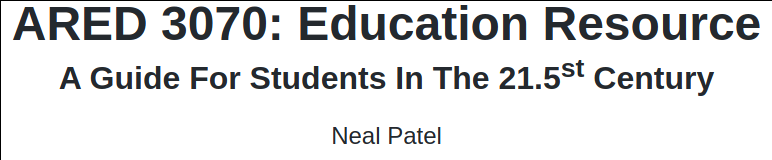
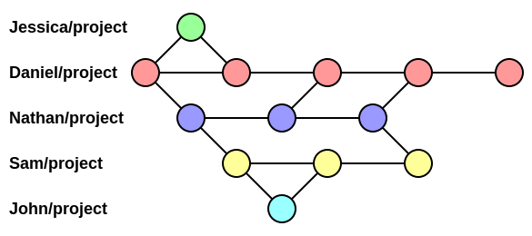
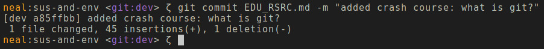

# Introduction

Creating simple, yet compelling messages is becoming increasingly difficult to accomplish in a world filled with distractions. Even more so, technological literacy is accelerating. I firmly believe that within the next twenty years or so we will see the widespread acceptance of computer science fundamentals on a grade school level.

In one form or another, it will become paramount to teach students about programming, binary, and other basic computer science concepts in a similar fashion to how our pupils learn about fractions, infinity, limits, etc today.

This resource is meant to be a lightweight guide that assumes very little foundational knowledge. However, it will be written in a manner that would be suitable to the future generations. Perhaps it could even act as a time capsule, standing the test of time.  

If I was a writing a mathematical resource in 2020, I would not start by explaining how counts of items can be abstracted by symbols we call numbers. Instead, I would simply begin by using those abstractions and talking about addition, subtraction, multiplication, and division. You need not mentally subtract 2 pencils from 5 pencils to obtain 3 pencils. Instead, you define these abstractions by their relation with each other. That is what empowers its usage.

I digress.

# Purpose

This educational resource will serve as a from-scratch how-to guide to building a digital intervention. In addition, it will (hopefully) allow those with very little experience to experience the thrill of tweaking and building something of their own.

# Crash Course To The 21.5st Century

### Files, Folders, and more!

On your computer, everything can be broken down into two atomic types: files and folders.

Folders contain other folders and files, right? Folders do contain those things; however, as newly annointed 21.5st century students, we throw out the 20th century notion of folders. We more accurately call these things **directories**, mainly because they index other directories and files.

Now, files contain data that might include instructions for your computer to open Netflix and continue the latest episode of *New Girl*, or it might pull up the PDF rubric for an assignment. While it is not important to understand for this resource, technically, directories are just files with the locations of other files. Everything is a file! Yay!

### What Is Git?

Imagine if you are working on an extremely complex document--a study guide, potentially with many other people. It would become annoying if you were being worked over, or if you halted our own work because someone was working on a piece of the document you also needed to work on.

In addition, what if someone makes a mistake? What if you make a mistake? What if something gets deleted that you needed? What if another document that linked to your document was deleted, breaking the connection?

This is where Git comes in. Git is what is known as a **version control system**, or VCS for short. Git will take all of your project documents and put them into something computer scientists like to call a tree.

You might be familiar with `Control-S` or `Command-S` for saving documents. Basic save operations create lines, not trees. You are able to undo and redo, going backwards and forwards respectively, in your document. However, this is not always helpful; imagine a situation where Jessica edits something you wrote. However, Jessica made a mistake, and you cannot undo her mistake since you did not make it. We clearly need a more robust "save" system.

This is where Git comes in. The tree allows you to jump back and forth through time, viewing your project and its state at different points. It even allows you to seperate out who did what, when, and why.

In Git, you do not `save`; instead, you `commit`. 

When you make a commit, it's customary to include a message: `git commit my_study_guide -m "added a section for how to take derivatives"`. Here, we issue a command to Git, telling it that we want to make a commit (think save) to `my_study_guide` with a `-m`essage which contains a brief description of what we did.

Where do we issue these commands? Who is Git? You can think of Git as a worker ready to take instructions at will; however, it will only accept a certain type of format for its instructions, otherwise it does not know what to do. This worker lives in your computer!

Using what is known as the Terminal, we can issue these commands. Remember a time when you've seen a bunch of random scrolling text on a black screen, typically portrayed as hacking? That's a terminal!

In fact, as I develop this resource, I am using git to ~save~ commit my changes!

I know it looks scary, but I assure you it's easier than it looks!

You might have noticed in the screenshot, my terminal tells me some additional info. For example, `neal:sus-and-env` lets me know that the current user is me, neal! It also tells me that I am currently executing my commands in a directory called `sus-and-env`. Additionally, `git:dev` lets me know that I am currently in a git-enabled directory, and my current **branch** is called `dev`, which is short for development.

Branching is quite literally what is sounds like! We talked about how our VCS is a tree! Well, we call it a tree because it has branches! Now many philosophies exist for *how* your branches should be set up. Some people will assign a branch to each person's work. Other systems will assign branches based on what is being worked on, regardless of how many people are working on it. 

*How* you branch is not as important as *why* you branch. When you create a branch, you are making a perfect replica of the project and *branching* it away from another branch, say the `main` branch. It is important to note that the simplest branch is a branch which contains nothing.

This will allow you to compare changes later amongst other branches. Then everyone can come together and decide what belongs on the `main` branch. The most important part here is that no matter what you do, a branch will save that **history** of work. So you branch to make it easier to navigate your changes and your project. Every project will have at least one branch, the `main` branch. Depending on the situation, some people choose to rename it.

For example, if I am creating a simple single-page application (SPA) website, I will typically call my `main` branch `dev`. Mainly because, after you finishing **developing** on the `dev` branch, you need to **build** your code so it can run on a server on the internet. Perhaps we call our branch with built code `build`. Notice, the `build` branch is not going to be a copy of `dev`. So it is not a strict requirement that branches contain the same or similar content.

**In summation,** git is a useful tool that empowers collaboration (with yourself or others) without sacrificing precision or control. It is quite literally what makes the world go round. That is not a hyperbole.

### What is NPM?

